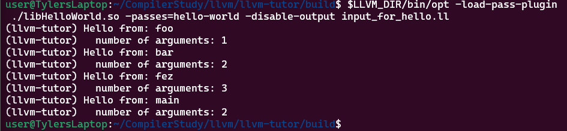
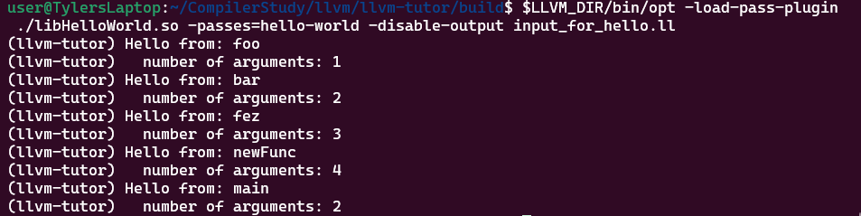
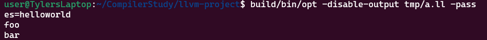

# LLVM Pass Development Diary
This document is a sort of mental mapping of what's going through my mind as I progress through my coursework. Updates will be in chronological order.

# 6/4/24

## WSL Adventures
I decided to mess around with WSL (specifically move my distro to my other, more spacious drive on my system. Of course, since I was dealing with Windows, it was a slightly tedious process, but ultimately solved thanks to [this StackOverflow page](https://superuser.com/a/1818070).

## Setting up Pass-Writing Environment
My plan with this is simple: in WSL I will pull this repo and work within it, compiling LLVM from source and writing all my passes in this. From there I will link to my additions to this in the other deliverable folders as they come.

Update: I used the guide provided by LLVM Tutor, but while I was able to install it, I wasn't able to get the test thing working due to an error with lit. More research needed before my setup will be ready to go.

# 6/17/24
I took a big break from working on this to focus on the ALG grant work that I had assigned to me. I intended to continue working on it again starting the 15th, but fell ill with the flu. Regardless, I plan for today to be a sprint to catch up on my past due work so that I can rebalance everything.

## Setting up Pass-Writing Evironment
Update 2: Trying the lit command this morning, it seems to be working now, despite me doing nothing related to it to change it. I'm unsure what caused it to suddenly work (or more likely, what I was doing wrong previously), but I'll take what I can get. Now that I have my setup working, I can continue with writing passes.

Update 3: It seems I incorrectly installed installed llvm-tutor last time, since some files were missing for whatever reason. After reinstalling and correctly building everything with CMake, everything is present.

## Writing a Hello World Pass

### Testing `llvm-tutor`'s Implementation
Before I write my own pass, I wanted to first take a look at how `llvm-tutor` creates their HelloWorld pass, which they make fairly easy to test following the instructions on their repo. Below is the results I got from successfully building and running the HelloWorld pass:

<figure>
	
	<figcaption>
		Fig. 1: Expected output for `llvm-tutor`'s HelloWorld pass
	</figcaption>
</figure>

This pass is an *analysis pass*, meaning that it looks at the provided .ll file given and outputs results based on the analysis collected. For example, this pass displays the name of every function in `input_for_hello.c` (and principly, `input_for_hello.ll`) along with the number of arguments for each function. If I add a function to the aforementioned C file...

```C
int newFunc(int a, int b, int c, int d) {
	return bar(a, fex(b, c, d));
}
```

...you'll see that the output changes to reflect this.

<figure>
	
	<figcaption>
		Fig. 2: Updated output with newly added function
	</figcaption>
</figure>

Looking at [the pass itself](https://github.com/banach-space/llvm-tutor/blob/main/HelloWorld/HelloWorld.cpp), you can see that it follows a similar pattern to [LLVM's official pass-writing guide](https://llvm.org/docs/WritingAnLLVMNewPMPass.html), though adding the additional functionality of counting the arguments. Instead of displaying the names alone within the class it's declared in, they created a separate function, `visitor`, to display both lines. Note that they also use a struct instead of a class, but I'm unsure why that is at this time.

That's all there is for this pass though, not much to it, and it should be easy to recreate from scratch (famous last words).

### DIY Time
For all the DIY portions of this project, I will be using a instance of the current version of LLVM (which at the time of writing this is LLVM 19) built from source so that I can go through all the motions of building, embedding, and using a custom pass added to LLVM, which the process is well documented in the pass-writing guide mentioned above. Lucky for me, there are already entries in the files so the pass is already registered, I just needed to add a `HelloWorld.cpp` and `HelloWorld.h` file. More information on everything that needs to be added can be found [here](https://llvm.org/docs/WritingAnLLVMNewPMPass.html#basic-code-required).

Once that's done, all you need to do is build `opt`. This takes a long time on the first go round, but subsequent builds should only run against updated files (such is the nature of make). Once `opt` is built, we can test any .ll file with the pass to see the output.

# 6/18/24

## Writing a Hello World Pass

### DIY Time

I created a new .ll file that has some sample functions...

```
define i32 @foo() {
	%a = add i32 2, 3
	ret i32 %a
}

define void @bar() {
	ret void
}
```

...before running our custom pass against it by using this command:

```
build/bin/opt -disable-output /tmp/a.ll -passes=helloworld
```

The `-disable-output` flag simply stops an output file from being created, instead printing the output to the screen. Once run, this is the result of the command:

<figure>
	
	<figcaption>
		Fig. 3: Testing my custom pass against a sample program
	</figcaption>
</figure>

Success! The pass is now working! With this we can expand and customize what this pass does to expand it's functionality, which will be left for the next deliverable. All files in the Deliverable 1 directory are copies of the pass files and test program used.

# 7/16/24

Wow, time certainly flies when you have a ton of other tasks both in and out of work! As it seems like my other classmates have, I was unable to get as much done as anticipated, but I wanted to try and get one more thing done before wrapping up for the term: adding my own pass to LLVM. In this case, I borrowed a pass from LLVM Tutor (specifically the OpcodeCounter pass) to try and add it and see if I can get LLVM to build and run the pass. Unfortunately, despite me adding references to the respective files according to LLVM's guides, I continued to get this error:

```{bash}
[100%] Building CXX object lib/Passes/CMakeFiles/LLVMPasses.dir/PassBuilder.cpp.o
In file included from /home/user/CompilerStudy/llvm-project/llvm/include/llvm/IR/PassManager.h:49,
                 from /home/user/CompilerStudy/llvm-project/llvm/include/llvm/Analysis/TargetLibraryInfo.h:15,
                 from /home/user/CompilerStudy/llvm-project/llvm/include/llvm/Analysis/LazyCallGraph.h:45,
                 from /home/user/CompilerStudy/llvm-project/llvm/include/llvm/Analysis/CGSCCPassManager.h:9,
                 from /home/user/CompilerStudy/llvm-project/llvm/include/llvm/Passes/PassBuilder.h:18,
                 from /home/user/CompilerStudy/llvm-project/llvm/lib/Passes/PassBuilder.cpp:17:
/home/user/CompilerStudy/llvm-project/llvm/include/llvm/IR/PassManagerInternal.h: In instantiation of ‘llvm::PreservedAnalyses llvm::detail::PassModel<IRUnitT, PassT, AnalysisManagerT, ExtraArgTs>::run(IRUnitT&, AnalysisManagerT&, ExtraArgTs ...) [with IRUnitT = llvm::Function; PassT = OpcodeCounter; AnalysisManagerT = llvm::AnalysisManager<llvm::Function>; ExtraArgTs = {}]’:
/home/user/CompilerStudy/llvm-project/llvm/include/llvm/IR/PassManagerInternal.h:88:21:   required from here
/home/user/CompilerStudy/llvm-project/llvm/include/llvm/IR/PassManagerInternal.h:90:41: error: could not convert ‘OpcodeCounter::run(llvm::Function&, llvm::FunctionAnalysisManager&)((* & IR), (* & AM))’ from ‘OpcodeCounter::Result’ {aka ‘llvm::StringMap<unsigned int>’} to ‘llvm::PreservedAnalyses’
   90 |     return Pass.run(IR, AM, ExtraArgs...);
      |                                         ^
      |                                         |
      |                                         OpcodeCounter::Result {aka llvm::StringMap<unsigned int>}
make[3]: *** [lib/Passes/CMakeFiles/LLVMPasses.dir/build.make:104: lib/Passes/CMakeFiles/LLVMPasses.dir/PassBuilder.cpp.o] Error 1
```

I'm unsure why this is occurring, as this isn't happening in the LLVM Tutor when I try to run it, but due to my lack of remaining time I'm not sure I'll be able to figure it out for now. 

# 7/18/24

## Epilogue

With the end of the semester in 4 days, I think it's time to wrap up my work on this for the time being. I definitely did not meet all the goals set for this course, but I think I gave myself a good place to continue working beyond the course. Between ALG work and things in my personal life, I did not expect to get so lost in everything else, but I think I am happy with my overall progress in everything I've done this summer.

Clément, thank you for the opportunity to allow me to continue working on understanding the inner workings of LLVM. I genuinely feel like I'm closer to making my own pass, and I'm glad I was able to do what I can.

This repo will likely turn into a place to collect all of the resources I've gathered/will gather relating to pass writing, as I intend to continue working within this environment since I already had it set up. 